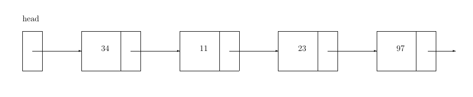

# Exercises - session 05

## Linked list
Implement a linked list with the following design. You are free to add more functions.

```c++
enum class Insertion_method { push_back, push_front };

template <typename T>
class List {
 public:
  using value_type = T;

  // insert a new node with the value v according to the method m
  // this method is used to fill the list
  void insert(const value_type& v, const Insertion_method m);

  // return the size of the list
  std::size_t size() const;

  // delete all the nodes of the list
  void reset();

  // constructor(s) for List

  // copy semantics (deep copy)
  // move semantics

  // destructor

 private:
  // private struct node with the proper value_type
  // why is a good idea nesting node?
  struct node {
    value_type value;
    std::unique_ptr<node> next;

    // implement suitable constructor(s) for node

    // copy and move semantics if needed

    // destructor
  };

  // append the newly created node at the end of the list
  void push_back(const value_type& v);

  // insert the newly created node in front of the list
  void push_front(const value_type& v);

  std::unique_ptr<node> head;
  std::size_t _size;

  friend std::ostream& operator<<(std::ostream& os, const List& l);
};

```

#### *Hints*:

- `std::move` is defined in header `utility`

- `std::unique_ptr` is defined in header `memory`

- A `std::unique_ptr<T> p` has the following functions
   - `T* get() const` Returns a pointer to the managed object or `nullptr` if no object is owned.
   - `T* release()` Releases the ownership of the managed object if any. `get()` returns `nullptr` after the call.
   - `void reset(T* ptr=nullptr)` Delete `current_ptr` (if any) and set `current_ptr = ptr`.
   - To check if a `std::unique_ptr<T> p` is different from `nullptr` you can simply use `if(p)` (there is no need to write `if (p.get())`).

-  For a class `Foo`

    ```C++
    class Foo{
      Foo(); // default ctor
      Foo(const Foo& f); // copy ctor
      Foo(Foo&& f); // move ctor
      
      Foo& operator=(const Foo& f); // copy assignment
      Foo& operator=(Foo&& f); // move assignment
    };
    ```

    

You are required to use blocks of memory (*heap*) locations which are linked together. Each of these blocks contains one component that may refer to another block. If each block (except the final one) contains a pointer to the next block, so that they form a chain, then the entire collection of linked blocks is called a **linked list**. The blocks of memory locations of a linked list are usually called *nodes*.

Each node of a linked list, except the final one, points to its immediate *successor*, and each node except the first one is pointed to by its immediate *predecessor*. The pointer member of the last node has the value `nullptr`.

The private member `head` points to the first element of the list. 



